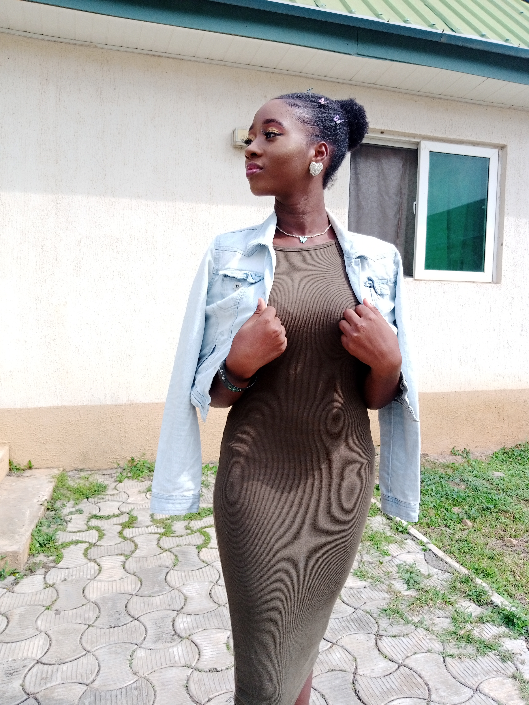

# Sophomore_Seminar
## Women Emmpowerment Project
This project focused on women and the great impact they can make, irrespective of their gender. It is a website for women to build a community and grow together.
It required a lot of functionality that I spent the semester implementing as each week progressed!

Time Spent: 16 weeks

Resources used: https://youtu.be/C5QFHp1oAws

Sample code :

Images Used:

